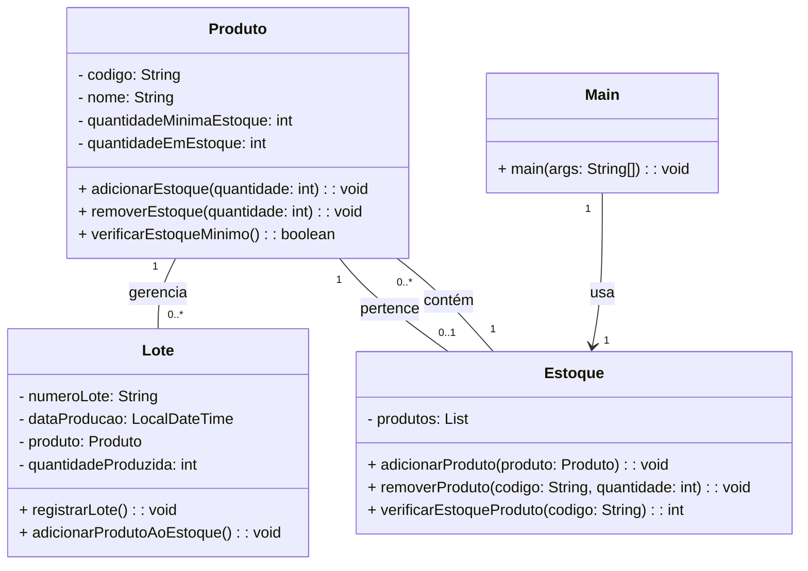

## Engenharia de Produção - Unidade 1 - Exercício 1

#### 1. (5,0) **Gestão de Produção e Controle de Estoque**

Faça a modelagem com fluxograma no padrão [Mermaid](mermaid.js.org) dos requisitos apresentados. Esse seria um sistema para gerenciar a produção e o controle de estoque de uma fábrica. 
O sistema permite o cadastro de produtos, o registro de lotes de produção e o controle das entradas e saídas de estoque. A modelagem inicial inclui as seguintes classes:

1. **Produto**: Esta classe representa os produtos da fábrica. Cada produto tem um código único, um nome, uma quantidade mínima de estoque e uma quantidade atual no estoque. A classe tem o seguinte contrato:
   - `adicionarAoEstoque(int quantidade)`: adiciona a quantidade especificada ao estoque.
   - `removerDoEstoque(int quantidade)`: remove a quantidade especificada do estoque.
   - `verificarEstoqueMinimo()`: verifica se a quantidade atual do produto é inferior à quantidade mínima definida para o produto.

2. **Lote**: Cada lote representa uma produção de um determinado produto. Um lote tem um número de identificação, uma data de produção e a quantidade de produtos produzidos. A classe tem o seguinte contrato:
   - `registrarLote()`: registra o lote e atualiza o estoque do produto correspondente.
   - `adicionarProdutoAoEstoque()`: adiciona a quantidade produzida ao estoque do produto.

3. **Estoque**: Representa o estoque da fábrica, contendo uma lista de objetos `Produto`. O contrato:
   - `adicionarProduto(Produto produto)`: adiciona um produto ao estoque.
   - `removerProduto(String codigo, int quantidade)`: remove uma quantidade específica de um produto do estoque, dado o código.
   - `verificarEstoqueProduto(String codigo)`: retorna a quantidade atual de um produto no estoque, dado o código do produto.

4. **Main**: A classe que simularia as operações do sistema, contendo:
   - Cadastrar novos produtos.
   - Registrar novos lotes de produção.
   - Atualizar o estoque com os produtos produzidos.
   - Registrar a saída de produtos para pedidos.

5. **Relatórios**: O sistema gera relatórios sobre os produtos com estoque baixo (abaixo da quantidade mínima) e relatórios sobre os lotes produzidos.

---

### Considerações

1. **Diagrama de Classes**: O diagrama de classes apresentado foi criado para ajudar:

### O que é pra entregar?
1. **Fluxogramas**: De acordo com o que foi apresentado, me entregue 4 fluxogramas, pelo github, utilizando a linguagem mermaid, para cada um dos fluxos de operações e interações dos diferentes componentes do sistema. Antes de entregar, teste o seu fluxograma em [mermaid.live](https://mermaid.live/). 

2. **Os fluxos** a ser entregues são:
- Cadastro de Produtos: Como os produtos serão adicionados ao sistema, considerando o código, nome e as quantidades mínima e atual de estoque.
- Registro de Lotes de Produção: Como os lotes de produção serão registrados, associando-os aos produtos e controlando a quantidade produzida e sua inserção no estoque.
- Controle de Estoque: O gerenciamento das entradas e saídas de produtos no estoque, incluindo a verificação de estoque mínimo e a atualização dos níveis de estoque.
- Geração de Relatórios: Como o sistema gera relatórios para produtos com estoque baixo e sobre os lotes produzidos.

2. **Nomes dos Arquivos**:
   
_unidade1_cadProdutos_fulanoDeTal.mmd_ 

_unidade1_regLotes_fulanoDeTal.mmd_ 

_unidade1_estoque_fulanoDeTal.mmd_ 

_unidade1_relatorios_fulanoDeTal.mmd_ 

1. **Melhoria**: Proponha melhorias no cadastro, considerando a volumetria dos produtos.
   
2. **Repositório GitHub**: Após concluir a modelagem, exporte o diagrama de classes para PNG utilizando Mermaid Live e faça o commit e push para o repositório GitHub da disciplina.