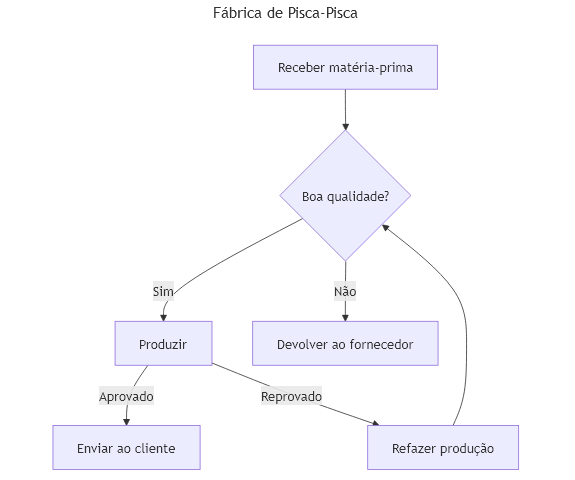

## Programação de Computadores - Unidade 1 - Exercício 2

#### (1,0) Imitando um Fluxograma

1. Crie o arquivo `unidade1/exercicio2_1.mmd` com o fluxograma descrito a seguir, usando a [documentação oficial](https://mermaid.js.org/syntax/flowchart.html) e o [editor Mermaid](https://mermaid.live/). Quando finalizar, faça o commit e push para o seu repositório, conforme [figura](https://drive.google.com/open?id=1dV5TwUdMxSmh80sx13epVcJFewIT_MVk).

Imite o fluxograma:

---

#### (1,0) Modelagem com Fluxograma

2. Crie o arquivo `unidade1/exercicio2_2.mmd` com o fluxograma descrito abaixo, usando a [documentação oficial](https://mermaid.js.org/syntax/flowchart.html) e o [editor Mermaid](https://mermaid.live/). Quando finalizar, faça o commit e push para o seu repositório, conforme [figura](https://drive.google.com/open?id=1dV5TwUdMxSmh80sx13epVcJFewIT_MVk).

   - **Fornecedor**: Envia matéria-prima.
   - **Armazém**: Recebe, registra e controla o estoque de matéria-prima.
   - **Linha de Produção**: Realiza a fabricação.
   - **Controle de Qualidade**: Avalia a conformidade dos produtos acabados.
   - **Setor de Embalagem**: Embala os produtos acabados.
   - **Expedição**: Organiza a saída dos produtos e emite notas fiscais.
   - **Clientes**: Recebem os produtos.
   - **Financeiro**: Gerencia os custos de produção e a receita gerada.

O fluxograma deve conter pelo menos 8 entidades e representar os fluxos de materiais, informações e decisões.
